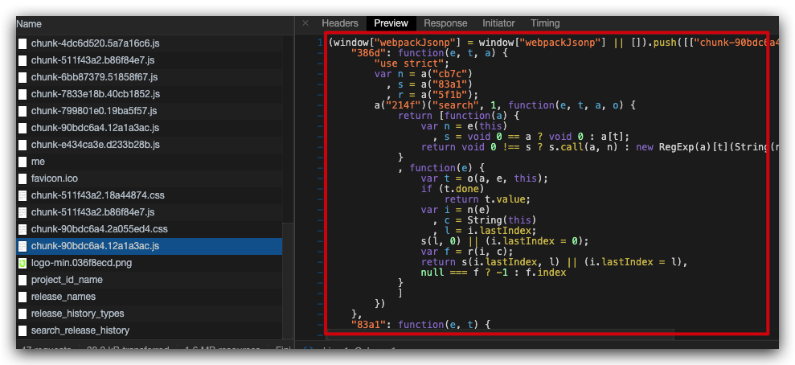

<!-- more -->

## prefetch & preload

我们知道通过 `<link rel=“preload">` 和 `<link rel=“prefetch”>`可以提前告诉浏览器如何加载我们的资源。

`rel="prefetch"` 的意思是告诉浏览器这个资源我之后可能会用到，你在空闲的时候帮我下载它吧。
而 `rel="preload"` 是告诉浏览器这个资源的优先级很高，浏览器会优先请求获取这个资源。

## 遇到的问题

今天后端的一个哥们找到我，说这个项目页面加载的速度太慢了，而且加载了一大堆资源。于是我们一起看了看页面的网络请求

可以看到请求中除了 `App` 必须的资源外，还包含了一大堆 `chunk` 的资源（也就是懒加载的资源）。

因为项目是用 `vue-cli` 创建的，`vue-cli` 默认开启了资源的 `prefetch` 和 `preload` 功能，打包后生成的 `index.html` 已经插入了许多带有 `preXXX` 的 `link` 标签，因此，本该懒加载的资源也在第一次加载页面时被下载了下来。

我截取了一小段 `HTML` 文本：

可以看到这些 `chunk` 资源都被打上了 `prefetch` 标记，而必须加载的资源被打上了 `preload` 标记。

## 第二个问题

向大佬们解释了一下 `prefetch` 的作用后，大佬又问了我一个问题：

“为什么 `prefetch` 下来的资源没有 `response data`，`HTTP Code` 明明是 `200`，而且跳转到其他页面之后，又去请求了这个资源，也就是同一个资源被请求了两次，是 `prefetch` 没起作用吗？”

😅 仔细一看，确实没有 `response data`，谷歌也给出了提示 `Faild to load response data`

## 分析

想一想，第二个问题中的第二点其实很好回答，因为 `prefetch` 只是帮我们预先请求了一次资源，等跳转到其他页面时再次请求这个资源时，浏览器会从 `prefetch cache` 中直接读取资源，并没有真正的去请求服务端，所以虽然我们看到了两次请求，其实真正到服务端获取资源只有一次。

可是，为什么 `prefetch` 加载的资源没有 `response data` ，通过浏览器直接访问资源的地址却是有内容的。

这个时候我想到了 `prefetch` 的本质是提前获取未来应用可能会用到的资源，浏览器只是去下载资源，并不会去 `load` 这个资源，这里的 `load` 是指浏览器去读取这个资源，而这个动作是在这个资源真正被用到时才需要执行的，这样也就是能理解为什么 `Chrome` 给的提示是 `Faild to load response data` 了，而 `HTTP Code` 为 `200` 则表示这个资源被下载下来了。

## 验证

我们尝试跳转到另一个页面，然后看下请求的资源是什么样的（注意这里不能勾选 `Network` 中的 `Disable cache`）

并且这个时候浏览器才会去加载资源

完！：）
